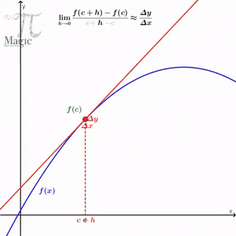
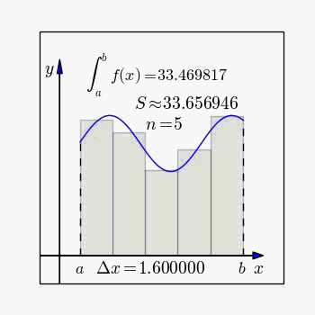

```{r setup, include=FALSE}
options(htmltools.dir.version = FALSE)
knitr::opts_chunk$set(warning = FALSE, message = FALSE)

```


# 1. Conceito de Função

--

- **Uso de funções matemática na análise de fenômenos econômicos:** 

--

 - Cálculo de receitas e lucros
  - Avaliação de investimentos (valor presente e futuro)
  - Análise de custos (fixos e variáveis)  
  - Depreciação de ativos
  - Modelagem de oferta e demanda  
  - Análise de risco e retorno de ativos financeiros  
  - Decisões de financiamento 
  
--

- **Função**: é uma regra que associa a cada elemento de um conjunto **A** um único
elemento de um conjunto **B**: y = f(x).

--

- A cada valor da **x** (variável independente) está associado um único valor de **y** (variável dependente). 


---

# Exemplo de Função


--

$$
D(t) = \frac{V_i - V_r}{V_u} \cdot t
$$
- ${V_i}$ = Valor Inicial;  
- ${V_r}$ = Valor Residual;
- ${V_u}$ = Vida Útil;

```{r, echo=FALSE, fig.align='center', fig.width=6, fig.height=4}
options(scipen = 999)

# Parâmetros da depreciação
valor_inicial <- 10000
valor_residual <- 1000
vida_util <- 10

# Cálculo da taxa de depreciação
taxa <- (valor_inicial - valor_residual) / vida_util

# Tempo (anos)
anos <- 0:vida_util

# Cálculo da depreciação acumulada e valor contábil
depreciacao <- taxa * anos
valor_livro <- valor_inicial - depreciacao

# Plotando o gráfico
plot(anos, valor_livro, type = "b", col = "#2C7865", pch = 19,
     xlab = "Ano", ylab = "Valor Contábil do Bem (R$)",
     main = "Depreciação Linear de um Ativo",
     ylim = c(0, valor_inicial))

# Linha do valor residual
abline(h = valor_residual, col = "red", lty = 2)
legend("topright", legend = c("Valor Contábil", "Valor Residual"),
       col = c("#2C7865", "red"), lty = c(1, 2), pch = c(19, NA))


```

---

# Tipos de Função


--

### 📈 Função Crescente

--

- f(x) é **crescente**: em um intervalo, ao aumentar o valor de x, o valor de f(x) também aumenta. $x_1 < x_2 \Rightarrow f(x_1) \leq f(x_2)$. **Exemplo**: f(x) = 2x + 1.

--

### 📉 Função Decrescente

- f(x) é **decrescente**: em um intervalo, ao aumentar o valor de x, o valor de f(x) diminui. $x_1 < x_2 \Rightarrow f(x_1) \geq f(x_2)$. **Exemplo**: f(x) = -3x + 10.

---

## Curvas de Oferta e Demanda

```{r, echo=FALSE, fig.align="center", fig.width=7, fig.height=5}
# Funções de demanda e oferta
curve_demanda <- function(x) 100 - 2 * x   # Função decrescente: p = 100 - 2x
curve_oferta <- function(x) 10 + 2 * x     # Função crescente:   p = 10 + 2x

# Intervalo do gráfico
x <- seq(0, 40, length.out = 100)
y_demanda <- curve_demanda(x)
y_oferta <- curve_oferta(x)

# Gráfico principal com linhas mais espessas
plot(x, y_demanda, type = "l", col = "blue", lwd = 4, ylim = c(0, 100),
     xlab = "Quantidade (x)", ylab = "Preço (p)", main = "Curvas de Oferta e Demanda")
lines(x, y_oferta, col = "darkgreen", lwd = 4)

# Legenda
legend("topright", legend = c("Demanda (decrescente)", "Oferta (crescente)"),
       col = c("blue", "darkgreen"), lwd = 4, bty = "n")

# Ponto de equilíbrio
abline(v = 22.5, h = 55, lty = 2, col = "gray", lwd = 2)
points(22.5, 55, pch = 19, col = "red", cex = 1.5)
text(22.5, 60, "Equilíbrio", col = "red", pos = 3)


``` 

---

# Tipos de Função


--

### 🔒 Função Limitada

- Quando seus valores (a imagem) ficam dentro de um intervalo específico. $f(x)$ é **limitada** em um intervalo $I \subseteq \mathbb{R}$ se **existem dois números reais** $M$ e $m$ tais que $m \leq f(x) \leq M \quad \text{para todo } x \in I$

--

.pull-left[ 
```{r, echo=FALSE, fig.align="center", fig.width=5, fig.height=3}
K <- 50             # Preço de exercício
S <- seq(0, 100, 1) # Preço do ativo
C_max <- 30         # Payoff máximo

payoff_limitada <- pmin(pmax(S - K, 0), C_max)

plot(S, payoff_limitada, type = "l", lwd = 2, col = "blue",
     xlab = "Preço do Ativo (S)",
     ylab = "Payoff",
     main = "Payoff: Call com Limite")
abline(h = C_max, col = "red", lty = 2)
text(90, C_max + 2, paste("Payoff Máximo =", C_max), col = "red")
```

]


.pull-right[
<span style="font-size: 0.7em;">
Opção de compra (call) com *payoff* limitado. O investidor não pode ganhar mais do que um certo valor máximo $C_{\text{max}}$. $f(S) = \min\left( \max(S - K, 0), C_{\text{max}} \right)$. Onde: $S$: preço do ativo no vencimento; $K$: preço de exercício (strike); $C_{\text{max}}$: *payoff* máximo; 
</span>
]


---

# Tipos de Função

--

### 🔀 Função Composta

--

- $f: B \rightarrow C$ e $g: A \rightarrow B$ duas funções. A **função composta** $f \circ g$ é definida por $(f \circ g)(x) = f(g(x))$ para todo $x \in A$, tal que $g(x) \in B$. **Exemplo**: $g(x) = x^2$ e  $f(y) = sen y$, então $(f \circ g)(x) = sen(x^2)$.


```{r, echo=FALSE, fig.align="center", fig.width=5, fig.height=3}

# Definindo as funções
g <- function(x) x^2         # g(x) = x²
f <- function(u) sin(u)      # f(u) = sen(u)

# Composição: (f ∘ g)(x) = sin(x²)
f_comp_g <- function(x) f(g(x))

# Domínio
x_vals <- seq(-2, 2, length.out = 300)

# Gerando gráficos
plot(x_vals, f_comp_g(x_vals), type = "l", col = "blue", lwd = 3,
     main = "Função Composta: (f ∘ g)(x) = sin(x²)",
     xlab = "x", ylab = "f(g(x))")

grid()

```

---

# 2 Modelos Lineares

--

Uma **função linear**: $f(x) = a \cdot x + b$. 

- $a$ é o **coeficiente angular** da reta, que determina a inclinação da linha. É a taxa de variação de $y$ em relação a $x$. Ou seja, para cada unidade que $x$ aumenta, $y$ aumenta (ou diminui, dependendo do sinal de $a$) em $a$ unidades~;


- $b$ é o **coeficiente linear** (ou **intercepto**), que é o valor de $f(x)$ quando $x = 0$. Este valor é o ponto onde a reta cruza o eixo $y$.

- **Exemplo**: função de custo total: $C(q) = C_f + C_v \cdot q$, com $C_f$ =  **custo fixo** (independente da produção);  $C_v$ = **custo variável unitário** e $q$ = **quantidade produzida**.

---

## Função de Custo, Receita e Ponto de Equilíbrio

--

```{r, echo=FALSE, fig.align="center", fig.width=8, fig.height=6}

# Parâmetros
C_f <- 1000   # Custo fixo
C_v <- 50     # Custo variável por unidade
p <- 80       # Preço de venda por unidade

# Funções
C <- function(q) C_f + C_v * q             # Custo total
R <- function(q) p * q                     # Receita total

# Quantidades
q <- seq(0, 100, by=1)

# Cálculos
custo_total <- C(q)
receita_total <- R(q)

# Ponto de equilíbrio
q_eq <- C_f / (p - C_v)                    # Quantidade no ponto de equilíbrio
C_eq <- C(q_eq)                            # Custo no ponto de equilíbrio (mesmo que receita)

# Gráfico
plot(q, custo_total, type="l", col="darkgreen", lwd=2,
     xlab="Quantidade produzida (q)", ylab="Valor monetário",
     ylim=c(0, max(receita_total)), main="Função de Custo, Receita e Ponto de Equilíbrio")
lines(q, receita_total, col="blue", lwd=2)
abline(h=C_f, col="red", lty=2)  # linha de custo fixo
points(q_eq, C_eq, pch=19, col="purple", cex=1.5)
text(q_eq + 3, C_eq, labels = paste("Break-even\nq =", round(q_eq, 1)), col = "purple")

legend("bottomright", legend=c("Custo Total", "Receita Total", "Custo Fixo", "Ponto de Equilíbrio"),
       col=c("darkgreen", "blue", "red", "purple"), lty=c(1,1,2,NA), pch=c(NA, NA, NA, 19), lwd=2)
grid()

```


---

# Regressão Linear Simples

--

-  **Função linear**: relação matemática determinística entre duas variáveis. 

- **Regressão linear simples**: modelo estatístico usado para **estimar** a relação entre uma variável independente $x$ e uma variável dependente $y$, com base em dados observados: $y = \alpha + \beta x + \varepsilon$. 

--


Onde:

- $y$: variável dependente (ou variável resposta)
- $x$: variável independente (ou variável explicativa)
- $\alpha$: intercepto da reta de regressão
- $\beta$: coeficiente angular (inclinação da reta)
- $\varepsilon$: termo de erro aleatório, que representa a diferença entre o valor observado e o valor estimado

---

## Exemplo da Resta Estimada

```{r, echo=FALSE, fig.align="center", fig.width=6, fig.height=4}

#
# Simulando dados para regressão linear
set.seed(123)
x <- 1:20
y <- 3 + 2 * x + rnorm(20, mean = 0, sd = 5)  # y com ruído

# Ajustando o modelo
modelo <- lm(y ~ x)

# Visualizando
plot(x, y, main = "Regressão Linear Simples", pch = 19, col = "darkblue",
     xlab = "Variável Independente (x)", ylab = "Variável Dependente (y)")
abline(modelo, col = "red", lwd = 2)
legend("topleft", legend = c("Dados observados", "Reta estimada"),
       col = c("darkblue", "red"), pch = c(19, NA), lty = c(NA, 1), lwd = 2)
```

--

<span style="font-size: 0.8em;">
A equação estimada da regressão linear simples é: $\hat{y} = \hat{\alpha} + \hat{\beta} x$. Com $\hat{y}$: valor estimado da variável dependente; $x$: variável independente (observada); $\hat{\alpha}$: estimativa do intercepto da reta de regressão; $\hat{\beta}$: estimativa do coeficiente angular (inclinação da reta).
</span>

---

# Função do 2º Grau

--

Uma **função quadrática** (ou função polinomial do 2º grau) é dada por:

$f(x) = a x^2 + b x + c$

Onde:

- $a$: coeficiente quadrático (determina a concavidade da parábola)
- $b$: coeficiente linear (inclinação da reta tangente no ponto de origem)
- $c$: coeficiente constante (valor de $f(x)$ quando $x = 0$)

---

## Aplicação: Função de Custo com Efeito de Economia de Escala

--

Considere uma situação onde há economia de escala ou ineficiências crescentes, fazendo com que o custo total aumente de forma **não-linear** à medida que a produção cresce. Uma função quadrática pode representar isso:

$C(q) = a q^2 + b q + c$

- $a > 0$: representa o efeito crescente de custo conforme aumenta a produção.
- $b$: representa o custo variável linear.
- $c$: é o custo fixo inicial.

---

## Gráfico: Custo Total Quadrático

```{r, echo=FALSE, fig.align="center", fig.width=8, fig.height=6}

# Parâmetros da função quadrática de custo
a <- 1     # Coeficiente quadrático
b <- 20    # Custo variável linear
c <- 500   # Custo fixo

# Função de custo quadrática
C_q <- function(q) a*q^2 + b*q + c

# Quantidades
q <- seq(0, 100, by=1)

# Custo total
custo_q <- C_q(q)

# Gráfico
plot(q, custo_q, type="l", col="darkred", lwd=2,
     xlab="Quantidade produzida (q)", ylab="Custo Total",
     main="Função de Custo Quadrática")
grid()
abline(h=c, col="blue", lty=2)
legend("topleft", legend=c("Custo Total Quadrático", "Custo Fixo"),
       col=c("darkred", "blue"), lty=c(1, 2), lwd=2)
```


---

## Regressão Polinomial de Grau 2

--

A regressão polinomial de segundo grau é uma extensão da regressão linear, que permite modelar relações não-lineares entre as variáveis:

$\hat{y} = \hat{\alpha} + \hat{\beta}_1 x + \hat{\beta}_2 x^2$

Onde:

$\hat{\alpha}$: intercepto estimado

$\hat{\beta}_1$: coeficiente linear estimado

$\hat{\beta}_2$: coeficiente quadrático estimado

$x$: variável independente


---

## Exemplo


```{r, echo=FALSE, fig.align="center", fig.width=8, fig.height=6}


set.seed(123)
x <- 1:20
y <- 2 + 1.5 * x - 0.1 * x^2 + rnorm(20, mean = 0, sd = 3)

# Ajuste de regressão quadrática
modelo_quad <- lm(y ~ x + I(x^2))

# Visualização
plot(x, y, main = "Regressão Polinomial de Grau 2", pch = 19, col = "darkgreen",
     xlab = "x", ylab = "y")
curve(predict(modelo_quad, newdata = data.frame(x = x)), add = TRUE, col = "orange", lwd = 2)
legend("topright", legend = c("Dados", "Ajuste Quadrático"),
       col = c("darkgreen", "orange"), pch = c(19, NA), lty = c(NA, 1), lwd = 2)

```


---

# Introdução ao Cálculo

1. Encontrar a reta tangente a uma curva em dado ponto da curva 

2. Encontrar a área da região plana limitada por uma curva arbitrária

--

```{r, echo=FALSE, fig.align="center", fig.width=7, fig.height=4}
# Carregar pacotes
library(ggplot2)

# Função f(x) = x^2
f <- function(x) x^2
f_prime <- function(x) 2*x  # derivada de x^2

# Ponto P
x0 <- 2
y0 <- f(x0)
slope <- f_prime(x0)

# Criar reta tangente: y = f(x0) + f'(x0)(x - x0)
tangent_line <- function(x) y0 + slope * (x - x0)

# Dados para gráfico
x_vals <- seq(0, 4, by = 0.1)
df <- data.frame(
  x = x_vals,
  y = f(x_vals),
  tangent = tangent_line(x_vals)
)

# GRÁFICO A - Declividade da reta tangente
p1 <- ggplot(df, aes(x = x)) +
  geom_line(aes(y = y), color = "blue", size = 1.2) +
  geom_line(aes(y = tangent), color = "red", linetype = "dashed") +
  geom_point(aes(x = x0, y = y0), color = "black", size = 3) +
  annotate("text", x = x0 + 0.5, y = y0 + 2, 
           label = paste0("Declividade = ", slope), color = "red") +
  labs(title = "a) Reta Tangente no Ponto P",
       x = "x", y = "y") +
  theme_minimal()

# GRÁFICO B - Área da região R (integral de f(x) = x^2 de 0 a 2)
area_df <- data.frame(
  x = seq(0, x0, by = 0.01)
)
area_df$y <- f(area_df$x)

p2 <- ggplot(df, aes(x = x)) +
  geom_line(aes(y = y), color = "blue", size = 1.2) +
  geom_area(data = area_df, aes(x = x, y = y), fill = "skyblue", alpha = 0.5) +
  labs(title = "b) Área da Região R sob a Curva",
       x = "x", y = "y") +
  annotate("text", x = 1, y = 2.5, label = "Área = ∫ x² dx = 8/3", color = "darkblue") +
  theme_minimal()

# Mostrar os gráficos juntos
library(gridExtra)
grid.arrange(p1, p2, ncol = 2)


```


---

# Noção Intuitiva de Limites

Vamos considerar a função: $g(t) = \frac{4(t^2 - 4)}{t - 2}$

A função **não está definida** em $t = 2$.

#### Cálculo do Limite

$$g(t) = \frac{4(t^2 - 4)}{t - 2} = \frac{4(t - 2)(t + 2)}{t - 2}$$
Para $t \neq 2$, a função pode ser simplificada:  $g(t) = 4(t + 2)$.

Logo, o limite quando $t \to 2$ é:

$$\lim_{t \to 2} g(t) = 4(2 + 2) = 4 \cdot 4 = 16$$
---

## Visualização Gráfica

```{r, echo=FALSE, fig.align="center", fig.width=9, fig.height=6}

# Definindo a função
g <- function(t) {
  ifelse(t != 2, 4 * (t^2 - 4) / (t - 2), NA)
}

# Vetores de valores de t
t_vals <- seq(1.5, 2.5, length.out = 400)
g_vals <- g(t_vals)

# Pontos à esquerda e à direita de t = 2
t_left <- seq(1.5, 1.99, length.out = 50)
t_right <- seq(2.01, 2.5, length.out = 50)

# Plot
plot(t_vals, g_vals, type = "l", col = "blue", lwd = 2,
     xlab = "t", ylab = "g(t)",
     main = expression(paste("Gráfico da função ", g(t), " com destaque no limite em ", t==2)))
abline(v = 2, col = "red", lty = 2)
points(2, 16, pch = 19, col = "darkgreen", cex = 1.5)  # ponto do limite
points(t_left, g(t_left), pch = 1, col = "orange")
points(t_right, g(t_right), pch = 1, col = "purple")
legend("topleft", legend = c("g(t)", "Limite t→2", "Antes de t = 2", "Depois de t = 2"),
       col = c("blue", "darkgreen", "orange", "purple"), pch = c(NA, 19, 1, 1),
       lty = c(1, NA, NA, NA), lwd = c(2, NA, NA, NA))
grid()


```


---


# Limite de uma Função


A função $f$ tem **limite $L$** quando $x$ se aproxima de $a$, o se denota por:

$$
\lim_{x \to a} f(x) = L
$$

se pudermos fazer o valor de $f(x)$ **tão próximo de $L$** quanto quisermos, **bastando tomar $x$ suficientemente próximo (mas não igual) a $a$**.

---

## Propriedades dos Limites

Suponha que: $\lim_{x \to a} f(x) = L \quad \text{e} \quad \lim_{x \to a} g(x) = M$

Então, valem as seguintes propriedades:

1. $\displaystyle{\lim_{x \to a}} [f(x)]^r = \displaystyle{[\lim_{x \to a}} f(x)]^r = L^r ,\quad \text{com } r \in \mathbb{R}$

--

2. $\displaystyle{\lim_{x \to a}  c} \cdot f(x) = c \cdot \displaystyle{\lim_{x \to a}} f(x) =  cL, \quad \text{com } c \in \mathbb{R}$

--

3. $\displaystyle{\lim_{x \to a}} [f(x) \pm g(x)] = \lim_{x \to a} f(x) \pm \lim_{x \to a} g(x) = L \pm M$

--

4. $\displaystyle{\lim_{x \to a}} [f(x) \cdot g(x)] = [\lim_{x \to a} f(x) ] \cdot [\lim_{x \to a} g(x)] = LM$

--

5. $\displaystyle{\lim_{x \to a}} \frac{f(x)}{g(x)} = \frac{\displaystyle{\lim_{x \to a}} f(x)}{\displaystyle{\lim_{x \to a} g(x)}} = \frac{L}{M}, \quad \text{com } M \neq 0$

---

## Exemplos Cálculo dos Limites

--

1. $\displaystyle{\lim_{x \to 1}}(5x^4 - 2) = \displaystyle{\lim_{x \to 1} 5x^4 } - \displaystyle{\lim_{x \to 1} 2}= 5(1)^4 - 2 = 3$

--

2. $\displaystyle{\lim_{x \to 3}} (x^2 \cdot \sqrt{x}) = \left( \lim_{x \to 3} x^2 \right) \cdot \left( \lim_{x \to 3} \sqrt{x} \right) = 3^2 \cdot \sqrt{3}= 9 \cdot \sqrt{3}$

--

3. $\displaystyle{\lim_{x \to 2}} \frac{x^2 + 2x}{x + 1} = \frac{\displaystyle{\lim_{x \to 2}} (x^2 + 2x)}{\displaystyle{\lim_{x \to 2}} (x + 1)}=\frac{2^2 + 2 \cdot 2 }{2 + 1}=\frac{4 + 4 }{2 + 1}=\frac{8}{3}$


---

# Limites no Infinito

--

Há situações em que queremos saber se f(x) tende a um único número quando $x$ cresce além de qualquer limite.

--

```{r, echo=FALSE, fig.align="center", fig.width=9, fig.height=6}
# Definindo a função
f <- function(x) 1 / x

# Intervalo de x
x <- seq(1, 100, by = 0.5)

# Valores da função
y <- f(x)

# Criando o gráfico
plot(x, y, type = "l", lwd = 2, col = "blue",
     xlab = "x", ylab = "f(x) = 1/x", main = "Limite no Infinito")
abline(h = 0, col = "red", lty = 2)  # assíntota horizontal
grid()

# Adicionando anotação
text(40, 0.1, labels = expression("lim"["x" %->% infinity] * frac(1, x) == 0), col = "darkred", cex = 1.2)

# Adicionando anotação
text(80, 0.08, labels = "y = 0 é a assíntota horizontal.", col = "red", cex = 1.2)


``` 

---

# TEOREMA 

Para todo $n > 0$, temos:

$\displaystyle{\lim_{x \to \infty}} \frac{1}{x^n} = 0 \quad \text{e} \quad \displaystyle{\lim_{x \to -\infty}} \frac{1}{x^n} = 0$

Desde que $\frac{1}{x^n}$ esteja definido.

--

**Exemplo**: Vamos considerar a função $f(x) = \frac{1}{x^2}$

Quando $x \to \infty$ ou $x \to -\infty$, o valor de $f(x)$ se aproxima de 0.

Portanto, $\displaystyle{\lim_{x \to \infty}} \frac{1}{x^2} = 0 \quad \text{e} \quad \displaystyle{\lim_{x \to -\infty}} \frac{1}{x^2} = 0$


---

# Funções Contínuas

De modo informal, uma função é contínua em um ponto se seu gráfico naquele
ponto não apresenta buracos, saltos ou quebras.

```{python, echo=FALSE, fig.align="center", fig.width=9, fig.height=6, cache=TRUE}

# Reimportando bibliotecas após reset do ambiente
import matplotlib.pyplot as plt
import numpy as np

# Criar três gráficos: contínua, com salto, e com buraco

x = np.linspace(-3, 3, 400)
y1 = np.sin(x)  # Função contínua
y2 = np.piecewise(x, [x < 0, x >= 0], [lambda x: np.sin(x), lambda x: np.sin(x) + 1])  # Com salto
y3 = np.sin(x)
y3[np.abs(x - 1) < 0.05] = np.nan  # Buraco em x = 1

fig, axs = plt.subplots(1, 3, figsize=(15, 4))

# Função contínua
axs[0].plot(x, y1, color="green")
axs[0].set_title("Função Contínua")
axs[0].grid(True)

# Função com salto
axs[1].plot(x, y2, color="red")
axs[1].set_title("Função com Salto")
axs[1].grid(True)

# Função com buraco
axs[2].plot(x, y3, color="blue")
axs[2].set_title("Função com Buraco")
axs[2].grid(True)

for ax in axs:
    ax.set_ylim(-2, 2)
    ax.axhline(0, color='black', linewidth=0.5)
    ax.axvline(0, color='black', linewidth=0.5)

plt.tight_layout()
plt.show()


```

--

Uma função $f(x)$ é **contínua** no ponto $x = a$ se as seguintes condições forem satisfeitas:

**1.** $f(a)$ está definida; **2.** $\displaystyle \lim_{x \to a} f(x)$ existe; **3.** $\displaystyle \lim_{x \to a} f(x) = f(a)$


---

# Conceito de Derivada

--

Considere a função de produção total $Q$ dependende de um insumo $x$: $Q = f(x)$.

--

Aumentando o insumo de $x$ para $x + \Delta x$, a produção muda de $f(x)$ para $f(x + \Delta x)$. A **taxa de variação média** da produção nesse intervalo é:

$$
\frac{f(x + \Delta x) - f(x)}{\Delta x}
$$

--

Essa razão indica **o quanto, em média, a produção aumenta a cada unidade adicional do insumo** no intervalo $\Delta x$.

---

##  Taxa de Variação Instantânea

A **derivada** é definida como o limite da taxa de variação média quando o intervalo tende a zero:

--

$$
f'(x) = \lim_{\Delta x \to 0} \frac{f(x + \Delta x) - f(x)}{\Delta x}
$$

--

A derivada $f'(x)$ representa o **produto marginal do insumo**, ou seja, quanto a produção aumenta ao se adicionar uma unidade extra do insumo, mantendo os demais fatores constantes.

--

- Se $x$ for o número de trabalhadores, então $f'(x)$ é o **produto marginal do trabalho**.

---

## Exemplo com Δx tendendo a zero

A derivada de $f(x) = x^2$ é dada por $f'(x) = \lim_{\Delta x \to 0} \frac{f(x + \Delta x) - f(x)}{\Delta x}=2$.

--

```{r, echo=FALSE, fig.align="center", fig.width=9, fig.height=6}

library(gt)
options(scipen = 999)
# Função f(x) = x^2
f <- function(x) x^2

# Derivada exata
f_prime <- function(x) 2 * x

# Pontos onde vamos calcular
x_vals <- 1


# Diferentes valores de Δx
delta_x <- c(1, 0.1, 0.01, 0.001, 0.0000001)

# Criar tabela com aproximações da derivada
library(dplyr)

resultado <- expand.grid(ValorX = x_vals, DeltaX = delta_x) %>%
  mutate(
    TxAprox = format(round((f(ValorX + DeltaX) - f(ValorX)) / DeltaX, 8), nsmall = 8),
    TxReal = format(round(f_prime(ValorX), 8), nsmall = 8)
  )

resultado %>%
  gt() %>%
  tab_header(
    title = "Derivada de f(x) = x² com diferentes Valores de Δx"
  ) %>%
  fmt_number(
    columns = everything(),  # Aplica o formato de número a todas as colunas
    decimals = 8  # Define 8 casas decimais
  ) %>%
  tab_spanner(
    label = "Resultados",
    columns = everything()
  ) %>%
  cols_align(
    align = "center",  # Centraliza as colunas
    columns = everything()
  ) %>%
  tab_style(
    style = list(
      cell_text(weight = "bold")
    ),
    locations = cells_column_labels(columns = everything())  # Torna o título da tabela em negrito
  ) %>% 
  tab_options(
    column_labels.background.color = 'dodgerblue',
    column_labels.border.bottom.style = 'none'
  )


``` 


---

## Interpretação Gráfica


--

```{r, echo=FALSE, fig.align="center", fig.width=9, fig.height=6}


```

<div style="text-align: center; font-size: 80%;">
Fonte: <a href="https://www.youtube.com/watch?v=azcIK8kcN7Q">Youtube</a>
</div>


---

## Derivada de f em x

--

A derivada de uma função $f$ é a função $f'$ que fornece a declividade da reta tangente ao gráfico de $f$ em qualquer ponto $(x,f(x))$ e também a taxa de variação de $f$ em
$x$. 

- Outras Notações para a Derivada

--

- $D_xf(x)$:  *Leia-se:* "d sub x de f de x"


- $\frac{dy}{dx}$:  *Leia-se:* "d y d x"


- $y'$:   *Leia-se:* "y linha"


---

## Regras de Derivação

--

📌 **Derivada de uma constante** 

Seja $c$ uma constante, então: $\frac{d}{dx} (c) = 0$. 

🔍 **Exemplo:** $\frac{d}{dx}(7) = 0$

--

📌 **Regra da potência** 

Para qualquer número real $n$: $\frac{d}{dx}(x^n) = n x^{n-1}$. 

🔍 **Exemplo:** $\frac{d}{dx}(x^5) = 5x^4$

---

## Regras de Derivação

--

📌 **Derivada de uma constante multiplicada por uma função** 

Seja $c$ uma constante, então: $\frac{d}{dx}[c \cdot f(x)] = c \cdot f'(x)$. 

🔍 **Exemplo:** $\frac{d}{dx}(3x^2) = 3 \cdot \frac{d}{dx}(x^2) = 3 \cdot 2x = 6x$

--

📌 **Regra da soma (ou subtração)**

$\frac{d}{dx}[f(x) \pm g(x)] = f'(x) \pm g'(x)$. 

🔍 **Exemplo:** $\frac{d}{dx}(x^2 + 4x) = \frac{d}{dx}(x^2) + \frac{d}{dx}(4x) = 2x + 4$


---

## Regras de Derivação

--

📌 **Regra do produto**

$\frac{d}{dx}[f(x) \cdot g(x)] = f'(x) \cdot g(x) + f(x) \cdot g'(x)$

 🔍**Exemplo:** 
 
 $\frac{d}{dx}(x^2 \cdot x^3) = 2x \cdot x^3 + x^2 \cdot 3x^2 = 2x^4 + 3x^4 = 5x^4$
 
--

📌 **Regra do quociente** 

$\frac{d}{dx} \left[\frac{f(x)}{g(x)}\right] = \frac{f'(x) \cdot g(x) - f(x) \cdot g'(x)}{[g(x)]^2}$

🔍**Exemplo:** 

$\frac{d}{dx} \left( \frac{x^2}{x^3} \right) = \frac{(2x) \cdot x^3 - x^2 \cdot 3x^2}{(x^3)^2} = \frac{2x^4 - 3x^4}{x^6} = \frac{-x^4}{x^6} = -\frac{1}{x^2}$


---

## Regras de Derivação

--

📌 **Regra da cadeia**

Se $y = f(g(x))$, então: $\frac{dy}{dx} = f'(g(x)) \cdot g'(x)$

De modo equivalente, se escrevermos $y = h(x) = g(u)$, onde $u = f(x)$, então $\frac{dy}{dx} = \frac{dy}{du} \cdot \frac{du}{dx}$


🔍 **Exemplo:** $f(x) = (3x^2 + 2)^5$

Aplicando a **regra da cadeia**:

$$\frac{d}{dx} \left[ (3x^2 + 2)^5 \right] = 5(3x^2 + 2)^4 \cdot (6x) = 30x(3x^2 + 2)^4$$
---

## Regras de Derivação

--

📌 **Derivada da função exponencial**

A derivada de $e^x$ em relação a $x$ é dada por:  $\frac{d}{dx} e^x = e^x$


🔍 **Exemplo:**

$\frac{d}{dx} e^{2x} = 2e^{2x}$

--

📌 **Derivada do logaritmo natural**

A derivada do logaritmo natural $\ln(x)$ é dada por: $\frac{d}{dx} \ln(x) = \frac{1}{x}$


🔍  **Exemplo:**

$\frac{d}{dx} \ln(3x) = \frac{1}{3x} \cdot 3 = \frac{1}{x}$

---

## Regras de Derivação

--

📌 **Derivada da função exponencial com base $a$**

Para funções exponenciais com base $a$, temos: $\frac{d}{dx} a^x = a^x \ln(a)$

🔍 **Exemplo:**

$\frac{d}{dx} 2^x = 2^x \ln(2)$

--

📌 Derivada de uma função composta com a exponencial

Se $y = e^{g(x)}$, a derivada é dada por: $\frac{d}{dx} e^{g(x)} = e^{g(x)} \cdot g'(x)$ 


🔍  **Exemplo:**

$\frac{d}{dx} e^{x^2} = e^{x^2} \cdot 2x$


---

# Derivadas de Ordem Superior

--

- Se $f(x)$ é diferenciável, então sua primeira derivada é $f'(x)$, e a derivada da derivada, ou seja, $f''(x)$, é a **segunda derivada**. De forma geral, a n-ésima derivada é $f^{(n)}(x)$. 

Primeira derivada: $\frac{dy}{dx}$

Segunda derivada: $\frac{d^2y}{dx^2}$

Terceira derivada: $\frac{d^3y}{dx^3}$

Enésima derivada: $\frac{d^n y}{dx^n}$


---

# Polinômio de Taylor

--

Se uma função $f(x)$ é infinitamente diferenciável em torno de um ponto $a$, o **Polinômio de Taylor** de ordem $n$ para $f(x)$ é dado por:

$P_n(x) = f(a) + \frac{f'(a)}{1!}(x - a) + \frac{f''(a)}{2!}(x - a)^2 + \cdots + \frac{f^{(n)}(a)}{n!}(x - a)^n$

--

Ou, de forma compacta:

$P_n(x) = \sum_{k=0}^{n} \frac{f^{(k)}(a)}{k!} (x - a)^k$

Esse polinômio aproxima a função $f(x)$ perto do ponto $a$ com base em suas derivadas sucessivas avaliadas em $a$.

---

# Aproximação de $e^x$

--

 Vamos construir o polinômio de Taylor de ordem 4 para $f(x) = e^x$, centrado em $a = 0$.

As derivadas são: $f(x) = e^x$; $f'(x) = e^x$; $f''(x) = e^x$; $f^{(k)}(x) = e^x$ para todo $k$.

Logo, $f^{(k)}(0) = 1$ para todo $k$.

--

 **Exemplo**: Aproximação de $e^x$

$$P_4(x) = 1 + \frac{x}{1!} + \frac{x^2}{2!} + \frac{x^3}{3!} + \frac{x^4}{4!}
= 1 + x + \frac{x^2}{2} + \frac{x^3}{6} + \frac{x^4}{24}$$


Esse polinômio aproxima $e^x$ para valores próximos de $x = 0$.


---

# Juros Compostos

--

**Juros compostos contínuos:** $M(t) = P \cdot e^{rt}$. 

Podemos usar o polinômio de Taylor para aproximar $e^{rt}$ quando a taxa de juros é pequena. Aproximação de $e^{rt}$ com Taylor de ordem 2 centrado em 0:

$$e^{rt} \approx 1 + rt + \frac{(rt)^2}{2}$$

Logo, o montante aproximado é:

$$M(t) \approx P \left(1 + rt + \frac{(rt)^2}{2} \right)$$

---

# 🧮 Cálculo em R

- Parâmetros
  - Capital inicial: P = 1.000
  - Taxa de juros (5% ao ano): r = 0.05
  - Tempo (1 ano): t = 1.

```{r, echo=FALSE, message=FALSE, warning=FALSE}
library(gt)
library(tibble)

# Parâmetros
P <- 1000       # Capital inicial
r <- 0.05       # Taxa de juros (5% ao ano)
t <- 1          # Tempo (1 ano)

# Montante exato com juros contínuos
M_exato <- P * exp(r * t)

# Montante aproximado com Taylor (ordem 2)
M_taylor <- P * (1 + r * t + (r * t)^2 / 2)

# Diferença entre os valores
erro <- M_exato - M_taylor

# Tabela
tibble(
  `Montante Exato` = round(M_exato, 2),
  `Montante Aproximado (Taylor)` = round(M_taylor, 2),
  `Erro` = round(erro, 2)
) |>
  gt() |>
  tab_header(
    title = "Comparação entre Juros Contínuos e Aproximação de Taylor"
  ) |>
  fmt_number(
    columns = everything(),
    decimals = 2,
    sep_mark = ".",
    dec_mark = ","
  )%>%
  cols_align(
    align = "center",  # Centraliza as colunas
    columns = everything()
  ) 
```


---

### Funções Marginais em Economia

--

A análise marginal é o estudo das taxas de variação das quantidades econômicas. **Exemplo**: Suponha que o **custo total** para a fabricação de $x$ refrigeradores seja dado pela função: $C(x) = 8000 + 200x - 0{,}2x^2, \quad \text{com } 0 \leq x \leq 400$

a) Qual o custo total envolvido na fabricação do 251º refrigerador?

--

O custo do 251º refrigerador pode ser estimado pela diferença $C(251) - C(250)$:

$= [8000 + 200(251) - 0{,}2(251)^2] - [8000 + 200(250) - 0{,}2(250)^2]$

--

$= 8000 + 50200 - 0{,}2 \cdot 63001 - \left(8000 + 50000 - 0{,}2 \cdot 62500\right)$

$= 45.599,80 - 45500 = 99,80$

---

### Funções Marginais em Economia

--

b) Determine a taxa de variação da função custo total com relação a $x$ quando $x = 250$.

A taxa de variação instantânea é dada pela derivada da função $C(x)$:

$C'(x) = \frac{d}{dx}[8000 + 200x - 0{,}2x^2] = 200 - 0{,}4x$

--

Substituindo $x = 250$:

$C'(250) = 200 - 0{,}4 \cdot 250 = 200 - 100 = 100$


Ou seja, no ponto $x = 250$, o custo está crescendo à razão de **100 dólares por refrigerador**.

---

## Função Receita

--

Uma função receita $R(x)$ fornece a receita obtida por uma empresa com a venda de $x$ unidades de certo bem: $R(x) = p \cdot x$. Se o preço unitário de venda $p$ está relacionado com a quantidade de bens $x$, $p = f(x)$. Assim, a **função receita** $R$ é dada por:

$$
R(x) = p \cdot x = x \cdot f(x)
$$

--

A receita marginal é o faturamento conseguido com a venda de uma unidade a mais
de um bem. Assim, a função receita marginal como R'(x) é a derivada R' da função R. 

---

### Funções Marginais em Economia

--

Suponha que a relação entre o preço unitário $p$ e a quantidade demandada $x$ de um produto seja dada pela equação: $p = -0{,}02x + 400 \quad \text{com } 0 \leq x \leq 20\,000$.

a) Determinar a função receita $R(x)$

$R(x) = p \cdot x = x(-0{,}02x + 400)=-0{,}02x^2 + 400x$

--

b) Determinar a função receita marginal $R'(x)$

A derivada da função: 

$R(x)$ é $R'(x) = \frac{d}{dx}(-0{,}02x^2 + 400x) = -0{,}04x + 400$


---

### Funções Marginais em Economia

--


c) Calcular $R'(2.000)$. 

Substituindo na derivada: 

$R'(2\,000) = -0{,}04(2\,000) + 400 = -80 + 400 = 320$.

**Interpretação:**  A receita marginal no ponto $x = 2.000$ é de **R$ 320**, o que indica que a venda do **2.001º** produto gera, aproximadamente, *R$ 320** adicionais de receita.


---

### Diferenciação Implícita e Taxas Relacionadas

--

Até o momento, temos lidado com funções na forma y = j{x), ou seja, funções na qual a
variável dependente y é expressada explicitamente em termos da variável independente x.
Entretanto, nem todas as funções são expressas dessa forma. 

Em alguns casos, uma função $y$ não é definida explicitamente, ou seja, na forma $y = f(x)$.

--

Por exemplo: na função $x^2 + y^2 = 25$ não é muito simplies isolar $y$ em termos de $x$ de forma explícita. 

Para encontrar $\frac{dy}{dx}$, usamos a **derivação implícita**, que consiste em derivar ambos os lados da equação com relação a $x$, tratando $y$ como uma **função de $x$**, ou seja, aplicando a **regra da cadeia** sempre que derivamos termos que envolvem $y$.

---

### Exemplo Diferenciação Implícita

--

Considere a equação: $x^2 + y^2 = 25$

Derivando ambos os lados com relação a $x$: 

$$
\begin{aligned}
\frac{d}{dx}(x^2) + \frac{d}{dx}(y^2) &= \frac{d}{dx}(25) 
\quad & \Rightarrow & \quad
2x + \frac{dy}{dx} \cdot 2y   = 0
\end{aligned}
$$

--

Isolando $\frac{dy}{dx}$:

$$
\frac{dy}{dx} = \frac{-2x}{2y} = \frac{-x}{y}
$$

Assim, a derivada de $y$ em relação a $x$ é $\frac{-x}{y}$, mesmo sem saber a função $y(x)$ de forma explícita.


---

### Aplicações da Primeira Derivada

--

- Teorema: função crescente e função descrescente: Seja $f$ uma função derivável em um intervalo $(a, b)$. Então:

--

a. Se $f'(x) > 0$ para cada valor de $x$ em $(a, b)$, então $f$ é **crescente** em $(a, b)$.

--

b. Se $f'(x) < 0$ para cada valor de $x$ em $(a, b)$, então $f$ é **decrescente** em $(a, b)$.

--

c. Se $f'(x) = 0$ para cada valor de $x$ em $(a, b)$, então $f$ é **constante** em $(a, b)$.


---

### Extremos Relativos

--


A função $f$ tem um **máximo relativo** em $x = c$ se existe um intervalo aberto $(a, b)$ contendo $c$, tal que $f(x) \leq f(c) \quad \text{para todos os } x \in (a, b)$

--

Uma função $f$ tem um **mínimo relativo** em $x = c$ se existe um intervalo aberto $(a, b)$ contendo $c$, tal que $f(x) \geq f(c) \quad \text{para todos os } x \in (a, b)$


---

### Extremos Relativos

--


```{r, echo=FALSE, fig.align="center", fig.width=9, fig.height=6}

# Pacotes necessários
library(ggplot2)
library(dplyr)

# Função e derivada
f <- function(x) x^3 - 6*x^2 + 9*x + 1
f_prime <- function(x) 3*x^2 - 12*x + 9

# Ponto crítico: derivada igual a zero
crit_points <- c(1, 3)
extrema <- tibble(
  x = crit_points,
  y = f(crit_points),
  tipo = c("Máximo Relativo", "Mínimo Relativo")
)

# Dados para gráfico
x_vals <- seq(-1, 5, length.out = 500)
dados <- tibble(x = x_vals, y = f(x))

# Gráfico
ggplot(dados, aes(x = x, y = y)) +
  geom_line(color = "steelblue", size = 1.2) +
  geom_point(data = extrema, aes(x = x, y = y, color = tipo), size = 3) +
  geom_text(data = extrema, aes(label = tipo), vjust = -1, hjust = 0.5) +
  labs(
    title = "Gráfico de $f(x) = x^3 - 6x^2 + 9x + 1$",
    subtitle = "Máximo e Mínimo Relativo",
    x = "x", y = "f(x)"
  ) +
  scale_color_manual(values = c("Máximo Relativo" = "red", "Mínimo Relativo" = "darkgreen")) +
  theme_minimal()

```


---

### Teste da Segunda Derivada

--

Seja $f$ uma função derivável duas vezes em um ponto $c$:

- $f'(c) = 0$ e $f''(c) > 0$, então $f$ tem **mínimo relativo** em $c$.
- $f'(c) = 0$ e $f''(c) < 0$, então $f$ tem **máximo relativo** em $c$.
- $f'(c) = 0$ e $f''(c) = 0$, o teste é **inconclusivo**.


--

- **Concavidade de uma Função**

- Se $f''(x) > 0$ para todo $x$ em um intervalo, então $f$ é **côncava para cima** nesse intervalo.
- Se $f''(x) < 0$, então $f$ é **côncava para baixo**.
- Se $''(x) = 0$ e muda de sinal, há um **ponto de inflexão**.

---

### Aplicação Segunda Derivada

--


```{r, echo=FALSE, fig.align="center", fig.width=9, fig.height=6}

# # Carregar pacotes
library(ggplot2)
library(dplyr)

# Função, primeira e segunda derivadas
f <- function(x) x^3 - 6*x^2 + 9*x + 1
f_prime <- function(x) 3*x^2 - 12*x + 9
f_double_prime <- function(x) 6*x - 12

# Gerar valores
x_vals <- seq(-1, 5, length.out = 500)
dados <- tibble(
  x = x_vals,
  y = f(x),
  fpp = f_double_prime(x),
  concavidade = case_when(
    fpp > 0 ~ "Concavidade para cima",
    fpp < 0 ~ "Concavidade para baixo",
    TRUE ~ "Ponto de inflexão"
  )
)

# Pontos de inflexão (onde f''(x) = 0)
inflexao_x <- 2
inflexao_y <- f(inflexao_x)

# Gráfico
ggplot(dados, aes(x = x, y = y)) +
  geom_line(aes(color = concavidade), size = 1.2) +
  geom_point(aes(x = inflexao_x, y = inflexao_y), color = "black", size = 3) +
  geom_text(aes(x = inflexao_x, y = inflexao_y, label = "Ponto de Inflexão (x=2)"), vjust = -1, hjust = 0.5) +
  scale_color_manual(
    values = c(
      "Concavidade para cima" = "darkgreen",
      "Concavidade para baixo" = "firebrick"
    )
  ) +
  labs(
    title = "Análise da Concavidade via Segunda Derivada",
    subtitle = "$f(x) = x^3 - 6x^2 + 9x + 1$",
    x = "x", y = "f(x)",
    color = "Concavidade"
  ) +
  theme_minimal()
```

---

# Integração

--

- Se conhecemos ataxa devariação de uma quantidade em relação a outra, podemos determinar a relação entre as duas quantidades?


- Uma função $F$ é uma **antiderivada** de $f$ em um intervalo $J$ se:

$F'(x) = f(x) \quad \text{para todo } x \in J.$

--

Isso significa que a derivada de $F$ é igual à função original $f$. Ou seja, encontrar uma antiderivada é o processo inverso da diferenciação.

> Exemplo: Se $f(x) = 2x$, então uma antiderivada é $F(x) = x^2$, pois, $\frac{d}{dx}(x^2) = 2x = f(x)$.

---

# Integração

--

Outro exemplo: 

- Seja $f(x) = 3x^2 + 2$, então $F(x) = x^3 + 2x + 1$ é uma antiderivada de $f$, pois $F'(x) = \frac{d}{dx}(x^3 + 2x + 1) = 3x^2 + 2 = f(x)$

- Uma função pode ter infinitas antiderivadas, que diferem apenas por uma constante. Por exemplo, todas as funções da forma:

$F(x) = x^2 + C$

são antiderivadas de $f(x) = 2x$, para qualquer constante real $C$.

---

# Integração

--

- O processo de determinar todas as antiderivadas de uma função é chamado **antidiferenciação**, ou **integração**. 

--

- Usamos o símbolo $\int$, denominado **sinal da integral**, para indicar que a operação de integração deve ser executada sobre uma função $f$. Assim:

$$
\int f(x)\, dx = F(x) + C
$$

Leia-se: *a integral indefinida de $f(x) \, dx$ em relação a $x$ é igual a $F(x)$ mais $C$*".

--

Isso nos diz que a **integral indefinida** de $f$ é a **família de funções** dada por $F(x) + C$, onde $F'(x) = f(x)$


---

# Regras de Integração

--

- **A Integral Indefinida de uma Constante**

Se $k$ é uma constante, então: $\int k \, dx = kx + C$

--

- **A Integral de uma Potência de $x$**

Se $n \neq -1$, então: $\int x^n \, dx = \frac{x^{n+1}}{n+1} + C$

--

- **Fator Constante**

Se $c$ é uma constante, então: $\int c \cdot f(x) \, dx = c \int f(x) \, dx$

---

# Regras de Integração

--

- **Integral de uma Soma ou Diferença**

$$
\int [f(x) \pm g(x)] \, dx = \int f(x) \, dx \pm \int g(x) \, dx
$$

--

- **A Integral da Função Exponencial**

$\int e^x \, dx = e^x + C$

Mais geralmente, se temos a função $e^{ax}$, com $a \neq 0$, então:

$\int e^{ax} \, dx = \frac{1}{a} e^{ax} + C$

---

## Exemplos com as Propriedades 

Vamos aplicar algumas propriedades básicas da integração indefinida para resolver integrais simples.

a. $\int 5 \, dx = 5x + C$

--

b. $\int (3x^2 + 4x) \, dx = \int 3x^2 \, dx + \int 4x \, dx = x^3 + 2x^2 + C$

--

c. $\int 7x^3 \, dx = 7 \cdot \int x^3 \, dx = 7 \cdot \frac{x^4}{4} + C = \frac{7}{4}x^4 + C$

--

d. $\int e^x \, dx = e^x + C$

--

e. $\int x^4 \, dx = \frac{x^5}{5} + C$


---

# Integral Definida

--


A **integral definida** de uma função contínua $f(x)$ no intervalo$[a, b]$ representa a **área sob a curva** de $f$ entre $x = a$ e $x = b$, considerando as áreas abaixo do eixo $x$ como negativas.

--

Formalmente, a **integral definida** é o limite de uma soma de Riemann:

$$\int_a^b f(x)\, dx = \lim_{n \to \infty} \sum_{i=1}^n f(x_i^*) \Delta x$$

--

onde: $[a, b]$ é dividido em $n$ subintervalos de comprimento $\Delta x = \frac{b-a}{n}$; $x_i^*$ é um ponto arbitrário dentro do $i$-ésimo subintervalo; $f(x_i^*) \Delta x$ é a área aproximada de um retângulo sob a curva.

---

# Interpretação Gráfica

```{r, echo=FALSE, out.width="40%", fig.align="center"}


```

<div style="text-align: center; font-size: 80%;">
Fonte: <a href="https://pt.m.wikipedia.org/wiki/Integral">Wikipedia</a>
</div>

---

# O Teorema Fundamental do Cálculo

--

Seja $f$ contínua no intervalo $[a, b]$. Então 

$$\int_a^b f(x)\, dx = F(b) - F(a)$$

onde $F$ é uma **antiderivada qualquer** de $f$, ou seja, $F'(x) = f(x)$.

--

Ao aplicar o **Teorema Fundamental do Cálculo**, é conveniente usar a notação

$$\int_a^b f(x)\,dx = F(x)\Big|_a^b = F(b) - F(a)$$

---

## Propriedades da Integral

--

Sejam $f$ e $g$ funções contínuas em um intervalo que contenha os pontos envolvidos, então:

1. $\int_a^a f(x)\,dx = 0$

--

2. $\int_b^a f(x)\,dx = -\int_a^b f(x)\,dx$

--

3. Se $c$ é uma constante, então: $\int_a^b c f(x)\,dx = c \int_a^b f(x)\,dx$

--

4.  A integral da soma é a soma das integrais: $\int_a^b [f(x) + g(x)]\,dx = \int_a^b f(x)\,dx + \int_a^b g(x)\,dx$

--

5. Se $a < c < b$, então:

$\int_a^b f(x)\,dx = \int_a^c f(x)\,dx + \int_c^b f(x)\,dx$


---

## Integração por Substituição

--

Considere a integral indefinida: $\int 2(2x + 4)^5 \, dx$

--

🔁 Etapa 1 - Substituição: Seja $u = 2x + 4 \quad \Rightarrow \quad du = 2 \, dx$. Então, isolando $dx$: $dx = \frac{du}{2}$ e substituindo na integral (1): $\int 2(2x + 4)^5 \, dx = \int (2x + 4)^5 \cdot 2 \, dx = \int u^5 \cdot du$

--

🔁 Etapa 2 - Resolvando a nova Integral usando a *Regra da Potência**: $\int u^5 \, du = \frac{u^6}{6} + C$.

--

🔁 Etapa 3: Retornar à variável original: Como $u = 2x + 4$, substituímos de volta: $\int 2(2x + 4)^5 \, dx = \frac{(2x + 4)^6}{6} + C$.

--

🔍 Verificação: $\frac{d}{dx} \left( \frac{(2x + 4)^6}{6} \right)$ = $\frac{1}{6} \cdot 6(2x + 4)^5 \cdot 2 = 2(2x + 4)^5$


---

## Funções de Várias Variáveis

--

Uma **função real de duas variáveis** $ f$ consiste em:

1. Um conjunto $A$ de **pares ordenados** de números reais $(x, y)$, chamado **domínio** da função.

2. Uma **regra de associação** que atribui a cada par ordenado $(x, y) \in A$ um único número real, denotado por $z = f(x, y)$.

--

🌐 Exemplo: A função $f(x, y) = x^2 + y^2$ é uma função de duas variáveis cujo valor em cada ponto do plano é dado pela soma dos quadrados das coordenadas. O domínio dessa função é:

$D = \mathbb{R}^2 = \{ (x, y) \in \mathbb{R} \times \mathbb{R} \}$

e para cada par $(x, y)$, temos: $f(x, y) = x^2 + y^2$

---

### 📊 Visualização Gráfica

```{r, echo=FALSE, message=FALSE, warning=FALSE, fig.align="center"}
library(plotly)

x <- seq(-2, 2, length.out = 50)
y <- seq(-2, 2, length.out = 50)
z <- outer(x, y, function(x, y) x^2 + y^2)

plot_ly(x = ~x, y = ~y, z = ~z) %>%
  add_surface() %>%
  layout(title = "Gráfico da função f(x, y) = x² + y²",
         scene = list(
           xaxis = list(title = "x"),
           yaxis = list(title = "y"),
           zaxis = list(title = "f(x, y)")
         ))
``` 


---

## Derivadas Parciais

--

Suponha que $f(x, y)$ seja uma função de duas variáveis $x$ e $y$. Então, a **derivada parcial de primeira ordem de $f$** com relação a $x$, no ponto $(x, y)$, é dada por:

$$
\frac{\partial f}{\partial x} = \lim_{h \to 0} \frac{f(x + h, y) - f(x, y)}{h}
$$

Desde que esse limite exista.

--

Analogamente, a **derivada parcial de primeira ordem de $f$** com relação a $y$, no ponto $(x, y)$, é:

$$
\frac{\partial f}{\partial y} = \lim_{k \to 0} \frac{f(x, y + k) - f(x, y)}{k}
$$


---

## Exemplo

--

Considere a função $f(x, y) = x^2 - x y^2 + y^3$. A Derivada parcial em relação a $x$ é $\frac{\partial f}{\partial x} = 2x - y^2$. Já a Derivada parcial em relação a $y$ é $\frac{\partial f}{\partial y} = -2xy + 3y^2$

--

Taxas de variação no ponto $(1, 2)$: Na direção $x$: $\frac{\partial f}{\partial x}(1, 2) = 2(1) - (2)^2 = -2$

> A função **diminui 2 unidades** para cada aumento de 1 unidade em \( x \), com \( y \) constante.

--

Taxas de variação no ponto $(1, 2)$: Na direção $y$: $\frac{\partial f}{\partial y}(1, 2) = -2(1)(2) + 3(2)^2 = -4 + 12 = 8$

> A função **aumenta 8 unidades** para cada aumento de 1 unidade em \( y \), com \( x \) constante.


---

### Função de Produção de Cobb-Douglas

--

Considere a função de produção: $f(x, y) = a x^b y^{1-b}$. Com $a$ e $b$ são constantes positivas com $0 < b < 1$; $x$ representa o valor gasto com **mão de obra**; $y$ representa o valor gasto com **capital** (equipamentos, prédios etc.) e $f(x, y)$ representa a **produção total**.

--


- **Produtividade Marginal da Mão de Obra**: $\frac{\partial f}{\partial x} = ab x^{b-1} y^{1-b}$

> Mede a **taxa de variação da produção** com relação ao gasto em mão de obra, mantendo o capital constante.

--

- **Produtividade Marginal do Capital**: $\frac{\partial f}{\partial y} = a(1 - b) x^b y^{-b}$

> Mede a **taxa de variação da produção** com relação ao gasto em capital, mantendo constante o gasto em mão de obra.

---

### Função de Produção de Cobb-Douglas

--


```{r, echo=FALSE, message=FALSE, warning=FALSE, fig.align="center"}
library(plotly)


# Parâmetros
a <- 1
b <- 0.4

# Criar grade de valores
x <- seq(1, 100, length.out = 50)
y <- seq(1, 100, length.out = 50)
z <- outer(x, y, function(x, y) a * x^b * y^(1 - b))

# Gráfico interativo
plot_ly(x = ~x, y = ~y, z = ~z) %>%
  add_surface() %>%
  layout(
    title = "Função de Produção de Cobb-Douglas",
    scene = list(
      xaxis = list(title = "Mão de Obra (x)"),
      yaxis = list(title = "Capital (y)"),
      zaxis = list(title = "Produção f(x, y)")
    )
  )

```


---

### Exemplo: Função Cobb-Douglas

--

A produção de certo país é descrita pela função: $f(x, y) = 30x^{2/3}y^{1/3}$, com $x$ representando unidades de mão de obra e $y$ unidades de capital.

a) Calculer $f_x$ e $f_y$

- Derivada parcial em relação a $x$:

$f_x = \frac{\partial}{\partial x}(30x^{2/3}y^{1/3}) = 30 \cdot \frac{2}{3} x^{-1/3} y^{1/3} = 20x^{-1/3}y^{1/3}$

--

- Derivada parcial em relação a $y$:

$f_y = \frac{\partial}{\partial y}(30x^{2/3}y^{1/3}) = 30x^{2/3} \cdot \frac{1}{3} y^{-2/3} = 10x^{2/3}y^{-2/3}$

---

### Exemplo: Função Cobb-Douglas

--

b) Produtividade marginal no ponto $(x = 125, y = 27)$

- Produtividade marginal de mão de obra:

$f_x(125, 27) = 20 \cdot 125^{-1/3} \cdot 27^{1/3} = 20 \cdot \frac{1}{5} \cdot 3 = 12$

- Produtividade marginal de capital:

$f_y(125, 27) = 10 \cdot 125^{2/3} \cdot 27^{-2/3} = 10 \cdot 25 \cdot \frac{1}{9} = \frac{250}{9} \approx 27.78$

--

c) Interpretação Econômica

- O aumento de uma unidade em **capital** gera aproximadamente **27.78 unidades** adicionais de produção. Já o aumento de uma unidade em **mão de obra** gera apenas **12 unidades** adicionais de produção. **Conclusão:** O governo deveria ter incentivado **investimentos em capital**, pois proporcionam um maior aumento de produtividade em comparação à mão de obra nesse contexto.

---

### Função de Produção de Cobb-Douglas

--


```{r, echo=FALSE, message=FALSE, warning=FALSE, fig.align="center"}
library(plotly)
# Carregar a biblioteca plotly
library(plotly)

# Definir a função Cobb-Douglas
cobb_douglas <- function(x, y) {
  30 * x^(2/3) * y^(1/3)
}

# Criar uma grade de valores para x e y
x_vals <- seq(1, 200, length.out = 50)  # Valores para x (mão de obra)
y_vals <- seq(1, 200, length.out = 50)  # Valores para y (capital)

# Criar uma matriz de resultados para f(x, y)
z_vals <- outer(x_vals, y_vals, cobb_douglas)

# Criar o gráfico 3D
fig <- plot_ly(
  x = rep(x_vals, each = length(y_vals)),
  y = rep(y_vals, times = length(x_vals)),
  z = as.vector(z_vals),
  type = "mesh3d"
)

# Adicionar títulos e rótulos aos eixos
fig <- fig %>%
  layout(
    title = "Função de Produção Cobb-Douglas",
    scene = list(
      xaxis = list(title = "Mão de obra (x)"),
      yaxis = list(title = "Capital (y)"),
      zaxis = list(title = "Produção (f(x, y))")
    )
  )

# Exibir o gráfico
fig


```


---

# Referências

--

.pull-left[
```{r, echo=FALSE, out.width="40%", fig.align="center"}


```

<div style="text-align: center; font-size: 80%;">
<a href="https://www.amazon.com.br/Matem%C3%A1tica-aplicada-administra%C3%A7%C3%A3o-economia-Tan/dp/8522116466">S. T. TAN</a>
</div>
 ]


.pull-right[
```{r, echo=FALSE, out.width="40%", fig.align="center"}


```

<div style="text-align: center; font-size: 80%;">
<a href="https://shopee.com.br/Livro-Matem%C3%A1tica-Aplicada-%C3%80-Administra%C3%A7%C3%A3o-Economia-e-Contabilidade-de-Afr%C3%A2nio-Murolo-Gi%C3%A1como-Bonetto-i.403437664.19898010034"> Afrânio Murolo & Giácomo Bonetto</a>
</div>
]